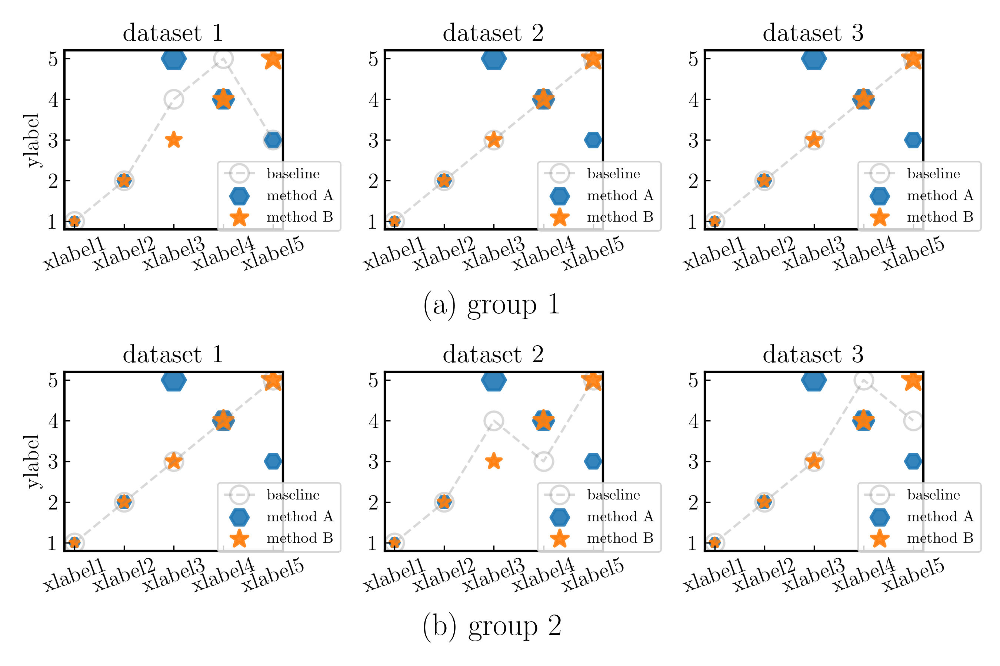

# MyPlotRepo
Some templates for visualizing data. Welcome any contributions!

## templates
| Types | Examples | Source code |
| --:   | --:      | --:         |
| Radar |  | [code for radar](src/draw_radar.ipynb) |
| Scatter |  | [code for scatter](src/draw_scatter.ipynb) |
| Step |  | [code for step](src/draw_step.ipynb) |
