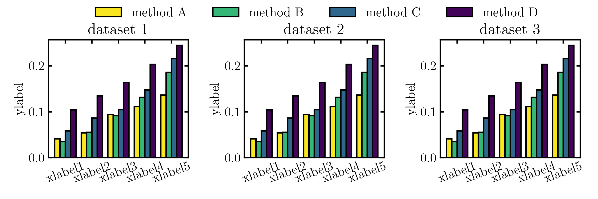

# MyPlotRepo
Some templates for visualizing data. Welcome any contributions!

## templates
| Types | Examples | Source code |
| --:   | --:      | --:         |
| Radar |  | [Code for radar](src/draw_radar.ipynb) |
| Scatter |  | [Code for scatter](src/draw_scatter.ipynb) |
| Step |  | [Code for step](src/draw_step.ipynb) |
| Multi-bar |  | [Code for multi-bar](src/draw_multibar.ipynb) |
| Pie |  | [Code for pie](src/draw_pie.ipynb) |
| Twinx |  | [Code for twinx](src/draw_twinx.ipynb) |
